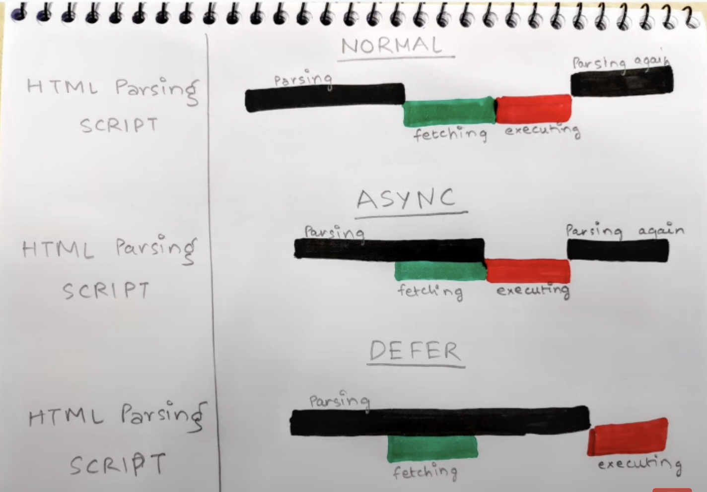

# Assignment 1

### 1 What is Emmet?

1. Emmet is a plugin or developer tool kit that helps make your work faster and substantially enhances HTML and CSS workflows.
2. As the name implies, Emmet Abbreviation saves you time and effort while allowing you to focus on more important matters. By converting acronyms into blocks of structured code in (X)HTML, CSS, XML, XSL, and JSP, Emmet speeds up coding.

### 2. Difference between a Library and Framework?
      
## Library 

1. Library is one that can be applied to any part of our existing app.
2. It does not INVERT THE CONTROL since the control is in the hands of the programmer who can use it where and when required
3. React is a library since it can be applied to any portion of our app like navbar or header etc.


## Framework

1. Framework is a whole full-fledged program that is used to build a whole app.
2. It INVERTS THE CONTROL since it provides the developer some places to plug in their code. It calls that code only as needed.
3. React is not a framework but a library. 

### 3. What is CDN? Why do we use it?

1. CDN Stands for Content Delivery Network.
2. It is neetwork of interconnected servers thats speed up web page loading of data heavy application.
3. when user visits a website, data from that website server has to travel accross the internet to reach user computer, if the user is located far from that server, it will take a long time to laod a large files such as video or website images instead of this, the website content is stored on CDN servers geographically closer to the user & reaches their computers much faster. 

### 4. Why is React known as React?

1. Because it is "Reacts" to any state or property changes, and works with data of any form (as deeply structured as the graph itself) so the name is fitting.

### 5. What is crossorigin in script tag?

1. The crossorigin attribute in the script tag enables Cross-Origin Resource Sharing (CORS) for loading external JavaScript files from a different origin than the hosting web page. This allows the script to access resources from the server hosting the script, such as making HTTP requests or accessing data.

2. Here's an example of using the crossorigin attribute:

    ```html
    <script src="https://example.com/script.js" crossorigin="anonymous"></script>
    ```

3. In this example, the script file script.js is loaded from the domain example.com, which is a different origin than the hosting web page. The crossorigin="anonymous" attribute ensures that the script cannot access sensitive information from the hosting web page.


### 6. What is diference between React and ReactDOM?

1. React focuses on building UI components and managing their state, while ReactDOM handles the actual rendering of those components into the browser's DOM.

2. We know React does not just run in Browsers, but also on Mobile, Android, etc. So we have different libraries for executing React on different platforms.
So we need 2 separate packages in our app.

### 7. What is difference between react.development.js and react.production.js files via CDN?

1. The React library provides two versions of its JavaScript files: react.development.js and react.production.js. The react.development.js is used in development stage/environment while the other is for production environment.
2. The react.development.js file is larger in size compared to react.production.js.The development version contains additional code, comments, and debugging information that aids in development and troubleshooting.
3. The development version (react.development.js) provides more detailed error messages and warnings compared to the production version. So it helps in better diagnostics
4. The production version is optimized for performance and has undergone various optimizations, including minification and removal of unnecessary code, resulting in a smaller file size.

### 8. What is async and defer?

1. In Normal HTML Parsing, html parsing goes on, as soon as the script tag is encountered, html parsing is stopped and the script is feteched from the network and then they are executed and then after that HTML parsing continues.

2. In Async HTML Parsing, html parsing goes on, and scripts are fetched in asyn manner i.e. parallely. Once the scripts are available, html parsing is stopped and scripts are executed and then after that HTML parsing continues.

3. In Defer HTML Parsing, html parsing goes on, and scripts are fetched in asyn manner i.e. parallely and will start the execution after the completion of the html parsing.



4. <span style='color:red'>Async attribute dos not guarantee the order of execution of the scripts. But Defer does guarantee. So Defer is Preferable. </span>
